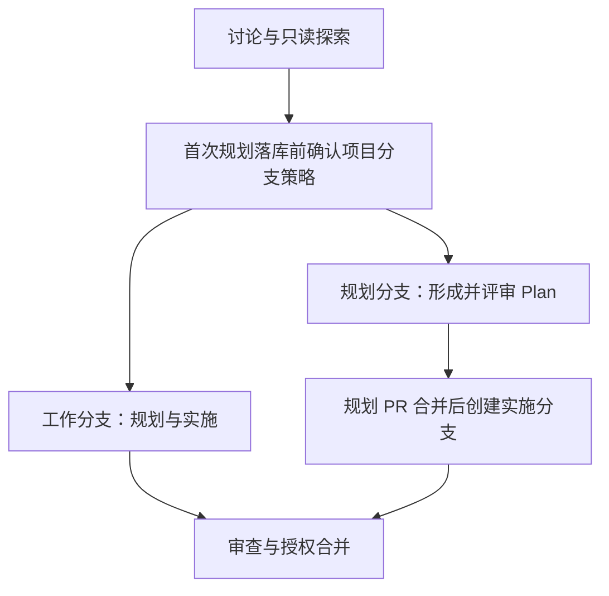

# NexusKit 下一阶段预想

## 定位与版本边界

这是一份基于维护者实际使用反馈及本次讨论整理的发想记录，不是需求规格、实施 Plan 或发布承诺。讨论以 v0.3.0 为下一大版本的暂称；能独立解决实际问题的部分可提前进入 v0.2.x，不必等待一次整体重构。当前不启动新一轮大迭代。

核心方向是“规范流程，削减方法论”：流程约束行为顺序、前后关系、职责、交接和完成条件；方法论指导单个行为怎样执行，例如实现与测试方法、审查视角、发想和需求澄清方式。模型能力持续增强，过于固定的方法可能限制其发挥，这是维护者提出的设计判断，尚未通过 NK 对照实验验证。

削减的对象是缺乏实际收益的规定动作，不是项目要求、范围边界、验证证据或用户授权。“方法论去 CE 化”意味着重新判断大量移植方法是否适合 NK，不以换来源为目标；有效的 CE 方法可以保留，必要时引入其他体系或理论，具体问题具体分析，暂未选定替代方案。

## 仓库与使用依据

- **direct：维护者在本次对话的反馈。** 小工作单元即使只有几行或十几行变更，仍可能触发过重审查；另有范围膨胀、无用防御等模型行为问题。这里保留问题与例子，不推断发生频率或量化成本。
- **direct：维护者补充的分支场景。** 项目开启主分支保护后，idea/plan 等需写入、提交的规划阶段不能继续默认在 main 上完成。应在规划落库前处理分支策略，而不是到实施阶段才建分支。
- **direct：当前实现。** [review](../../skills/nk-review/SKILL.md) 常规路径包含风险角色、simplify 与独立复核；[work](../../skills/nk-work/SKILL.md) 以一个确认单元为执行边界；[compound](../../skills/nk-compound/SKILL.md) 融合沉淀、审计与显式复盘。它们是后续核对对象，不代表已决定全部替换。
- **direct：本轮已落地的流程修正。** 外部 PR 合并前复用审查并确认合并条件，合并后只收尾维护者侧产物，见 [close](../../skills/nk-close/SKILL.md)、[生命周期约定](../../skills/conventions/artifact-lifecycle.md)；这项文本调整已提交，但尚未实跑新增路径。
- **direct：现有设计基础。** [执行材料组织决定](../solutions/architecture-decisions/2026-09-28-skill-execution-locality.md) 解决入口、完整方法与条件材料的组织边界；[来源映射](../skill-sources.md) 可定位方法出处。本轮预想进一步讨论规则的必要性，不能把文件组织改善当作方法有效性的证据。

## 主题轴

- 流程责任与审查成本。
- 分支、规划与协作边界。
- 核心方法的收益和限制。
- 知识沉淀质量与长期消费。
- 远期自定义能力。

## 候选方向

以下顺序是讨论优先建议，不是实施顺序。置信度表示值得继续探索的主观判断，不是成功率或实测结论。

### 1. 让流程强度随风险和证据缺口调整

**描述：** 明确各环节的责任、输入输出、完成与停止条件，减少固定编队、重复审查和无收益产物。已有审查、测试或类型约束覆盖的内容可以复用；额外步骤应说明补足了什么缺口。几行修改不自动触发重流程，也不自动豁免高风险审查。

**轴：** 流程责任与审查成本。

**依据：** direct：维护者的小改动重审查反馈，以及 [#42](https://github.com/steven123397/nexuskit-skills/issues/42) 的既有问题入口；reasoned：行数不能代表权限、迁移、CI 等修改的失败后果。

**理由：** 直接解决日常摩擦，同时保持审查发生在合并决策之前。外部 PR 的既有完整审查应复用，不再默认叠加一次同范围 pre-merge。

**代价：** 放宽固定编队后，需要观察 Agent 是否会低估风险、遗漏必要独立视角；不能只比较调用次数或执行速度。

**置信度：** 95%。**复杂度：** 中。**版本弹性：** 有独立证据的小范围分流改进可进入 v0.2.x。

### 2. 在规划落库前介入分支策略，覆盖完整交付

**描述：** 分支不再只是 work 开始后的执行容器。需要提交发想或 Plan 之前，先按项目规则确认承载分支；实施、审查、合入和产物收尾围绕同一交付对象衔接。只读探索与不落库的讨论不必机械建分支。

**轴：** 分支、规划与协作边界。

**依据：** direct：维护者已遇到主分支保护使“先在 main 提交 Plan，再开实施分支”不适用。reasoned：保护规则约束所有仓库变更，规划文档并不例外；单人项目也可能保护 main。

**理由：** 将分支决定提前到首次需要入库的产物，避免 Agent 到实施阶段才发现前序规划无法提交。单元负责局部交付，分支/PR 负责完整交付；作者、审查者、维护者可以由同一人或不同人承担，不必维护两套互不相容的流程。

可探索的两条路线由项目选择，不预设其中一条为统一默认：

**代价：** 规划和实施分离会增加交接成本；合在一个分支则未必适合需要先评审设计的团队。仍需具体讨论分支创建责任、现有分支复用和不同项目策略，尚无统一实现方案。

**观察场景：** 开启主分支保护后，从发想、规划到合入均无需用户中途纠正分支选择；同一套责任划分可覆盖单人、协作者和外部 PR。

**置信度：** 95%。**复杂度：** 大。**版本弹性：** 局部修正可提前发布，跨技能的完整分支模型更适合作为下一大版本方向。

### 3. 从真实失败模式出发削减核心方法论

**描述：** 重点核对 work、review（含 simplify）、ideate 与 brainstorm。保留交付与证据要求，削减模型已能可靠处理的通用教学、僵硬思考顺序、重复角色和纯格式负担；不以文本短或少派 Agent 本身作为成功标准。

**轴：** 核心方法的收益和限制。

**依据：** direct：维护者列举范围膨胀和无用防御；reasoned：约束应帮助模型判断真实需求与后果，不能只要求笼统的“保持简单”。

两类优先观察案例：

- **范围膨胀。** 修一个问题却顺手重构无关模块。当前目标需要的调用方修改、数据迁移和测试必须一起完成；没有当前用途的扩展、抽象与顺手整理应停止或另行定界，不能把“少改文件”当成完整交付。
- **无用防御。** 无人读取的 checksum、面向想象中未来的兼容层缺少价值。防御应能发现问题，并进入拒绝、恢复或诊断路径；有效的保留，无用的省掉，吞错报成功或制造重复副作用的实现需要修正。

**理由：** 从已发生的问题判断规则是否有效，比按 CE 章节逐条扩充更贴近 NK 的实际目标。这两个例子不是完整问题清单，后续案例仍由真实开发提供。

**代价：** 必须区分模型暂时做不好、项目特定要求和过时指导；一次成功不足以证明可以永久删除方法，也不能为每个失败例子再新增一套固定清单。

**置信度：** 85%。**复杂度：** 大。**版本弹性：** 可逐模块、逐问题进入 v0.2.x，体系性的职责与方法重构留给后续大版本。

### 4. 对 nk-compound 做具体、详细的方法核对

**描述：** 单独审视 CE compound/refresh 与 Matt retro 的融合，区分沉淀/审计模式、Bug/Knowledge 内容轨道及显式复盘的实际用途；不先决定维持还是拆分当前结构。

**轴：** 知识沉淀质量与长期消费。

**依据：** direct：维护者明确要求详细核对；当前来源与方法见 [compound 来源](../skill-sources.md#nk-compound)、[知识契约](../../skills/conventions/solution-schema.md)。reasoned：一次错误沉淀可能被未来会话反复引用，其影响不同于一次性报告。

拟核对的问题包括：什么值得保存、什么已有代码或测试足以表达；复盘观察、已采纳决定与已验证经验是否混淆；如何去重、修订和取代；未来 Agent 如何发现条目并判断适用条件；审计是否提升知识质量而不仅整理目录；长期收益是否抵得上生成和维护成本。

**理由：** 检验双轨结构和复盘融合是否真正互补，避免因融合了多个上游就认定方法完整有效。

**代价：** 需要真实沉淀及后续消费案例，当前讨论不足以判断各方法的效果；不能仅靠结构检查完成验收。

**置信度：** 90%。**复杂度：** 中至大。**版本弹性：** 先核对，具体修正可独立发布，不绑定 v0.3.0。

### 5. 远期探索可插拔的流程与方法组件

**描述：** 用户按自身需要选择流程和方法组件，组合成适用的体系，甚至自行定义组件。目前仅为概念，没有组件协议、配置方式、执行引擎或可落地方案。

**轴：** 远期自定义能力。

**依据：** direct：维护者提出的更激进构想，前提是前一轮调整后的实际问题较少；reasoned：只有输入输出、责任和停止条件经过验证，才可能形成稳定的组合边界。

**理由：** 可能减少单一方法对不同开发者的限制，但应先观察下一阶段哪些边界自然稳定，而不是现在把现有文件包装成组件。

**代价：** 组合可能产生循环、遗漏或冲突，配置和兼容成本也可能超过节省的方法负担；高度自定义未必等于更易用。

**置信度：** 40%。**复杂度：** 大且未定。**版本弹性：** 远期研究候选，不作为下一大版本的交付承诺。

## 未采纳或暂缓的解释

| 想法 | 原因 |
| :-- | :-- |
| 将全部方向绑定 v0.3.0 一次交付 | 有用的小改进可提前进入 v0.2.x；当前没有启动大迭代 |
| 按改动行数固定决定审查强度 | 行数不代表风险，也不说明已有证据是否充分 |
| 为去 CE 化删除所有 CE 方法 | 来源不是有效性的判断标准，也没有选定替代体系 |
| 将所有流程固定成单一路径 | 项目保护规则、规划评审和协作责任存在实际差异 |
| 一律先在 main 提交 Plan 再开分支 | 不适用于开启主分支保护的项目 |
| 外部 PR 合并后再常规重审一遍 | 质量确认应支持合并决策，合并后收尾不应重复同一评审 |
| 立即建设可插拔框架 | 概念与落地边界尚不清楚，可能固化当前需要削减的复杂度 |

本记录整理既有讨论，未进行新一轮外部研究、多代理发散或独立行为实验。它保留候选、取舍和未决问题，不将方向共识视为效果验证。
