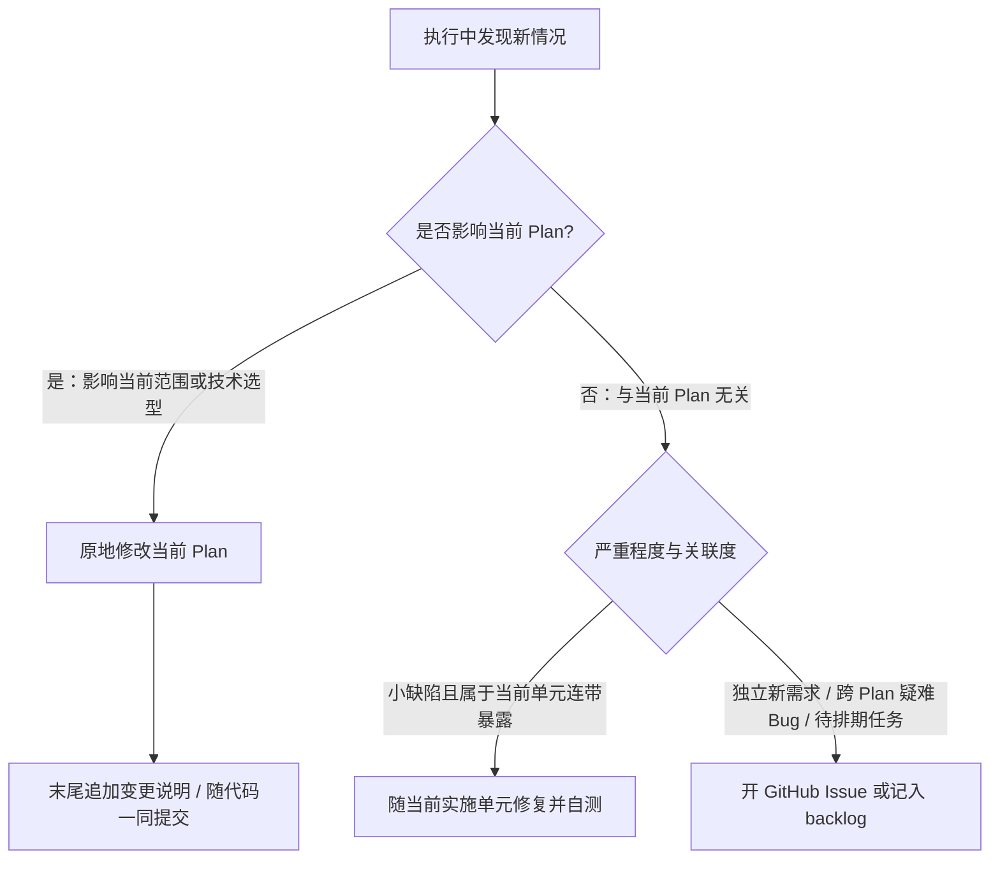

# 产物全生命周期管理规范 (Artifact Lifecycle)

> **核心哲学：** 过程工件活在工作分支，收尾时提炼清理。所有产物从产生时就具有明确的终点，不在主干分支积累历史死文档。

---

## 一、产物分类与生命周期矩阵

| 产物类型 | 物理位置 | 生命周期 | 产生/演进方式 | 终点与归宿 |
| :-- | :-- | :-- | :-- | :-- |
| **Ideation (发想记录)** | `docs/ideation/*.md` | 短期 / 阶段性 | [/nk-ideate](../nk-ideate/SKILL.md) 创建；30 天内同主题再次发想时更新原文件而非新建 | 被选中的方向进入 Plan 后，随消费它的分支收尾删除；未被消费的发想记录不随分支删除，收尾时询问是保留、转为 Issue 还是删除 |
| **Plan (方案与计划)** | `docs/plans/*.md`（工作分支；单分支项目在 main 上，格式见 [`plan-format.md`](plan-format.md)） | 短期 / 阶段性 | [/nk-brainstorm](../nk-brainstorm/SKILL.md) 创建需求部分，[/nk-plan](../nk-plan/SKILL.md) 补全实施部分，实施过程中根据新发现直接就地修改 | 收尾时提炼架构决策/术语后删除；不留未维护的历史死 Plan，完整过程由 Git 留存 |
| **Review (审查记录)** | `docs/reviews/*.md`（工作分支；单分支项目在 main 上） | 短期 / 阶段性 | [/nk-review](../nk-review/SKILL.md) 创建并追加审查条目 | 修复随代码提交更新；收尾时遗留项转 Issue，文件删除 |
| **Current (会话入口)** | `docs/current.md` | 常驻（单例覆盖） | nk-commit 提交前按需更新；显式 nk-handoff 保存现场 | 持续覆盖更新，始终反映当前真实状态 |
| **Issue / 待办 / 探针** | GitHub Issues（无远端时降级为 `docs/backlog.md`） | 中期（任务生命周期） | [/nk-to-issue](../nk-to-issue/SKILL.md)（核实落档）、[/nk-wayfinder](../nk-wayfinder/SKILL.md)（探针）、跨 plan 疑难 bug、推迟项 | 完成后关闭（Closed），依靠 Issue 平台状态流转与归档；认领与关闭时机见 [`issue-writing.md`](issue-writing.md) 第三、四节 |
| **Solutions (经验与决策)** | `docs/solutions/<category>/*.md` | 长期 / 永久资产 | [/nk-compound](../nk-compound/SKILL.md) 沉淀，或收尾时从 plan 提炼 | 永久沉淀；由 refresh 定期审计是否过时或漂移 |
| **Concepts (领域术语)** | 根目录 `CONCEPTS.md` | 长期 / 永久资产 | [/nk-brainstorm](../nk-brainstorm/SKILL.md) / [/nk-plan](../nk-plan/SKILL.md) 即时录入，[nk-compound](../nk-compound/SKILL.md) 补全 | 永久沉淀；由 refresh 定期审计 |
| **项目特有流程** | 项目自选工作流文档（由 `AGENTS.md` 索引） | 长期 | 项目自身维护 | 外部技能读取遵循、不内置、不侵入 |
| **PR 描述 / Release Note** | GitHub PR 描述 / `docs/releases/*.md` | 可选 / 永久 | PR 开启时写 PR 描述；发布日写 release notes | PR 合并归档；release notes 永久留存 |

> **分支策略由项目决定**：项目工作流文档规定了分支约定就照做；没有规定时留在当前分支、不自动建分支（个人项目常直接在默认分支或 main 上工作）。技能读取项目约定而不内置强制的分支流程。

---

## 二、知识入口的可见性维护 (Discoverability)

为了确保任何新会话或新接入的 Agent 都能快速感知并复用沉淀的知识，必须保持全局指引可见：
* 项目根目录的 **`AGENTS.md`（或等价的全局指令文件）必须包含指向 `docs/current.md`、`docs/solutions/` 和已存在的 `CONCEPTS.md` 的显式指引行**。
* **维护责任归属**：在项目首次初始化（bootstrap）或初次运行 [/nk-compound](../nk-compound/SKILL.md) 时，Agent 应检查 `AGENTS.md`；若缺少对应入口指引，应补充指引声明，确保知识库可被后续会话检索。[/nk-close](../nk-close/SKILL.md) 提炼阶段若首次创建 `CONCEPTS.md` 或 `docs/solutions/`，同样触发本检查。

### 经验消费契约

导航同时说明使用时机，供普通会话与技能共同遵循。可在现有 solutions 指引后补充：

> 涉及设计取舍、非琐碎实现或排障时，按当前主题、模块或症状定向检索 `docs/solutions/`；已有适用检索结果直接复用，只精读相关条目。目录不存在或无匹配时照常推进，不为读取经验触发沉淀或审计。

- 这是项目知识入口的最小行为指引；已有等效规则则复用，与项目规则冲突时报告，不覆盖既有流程。init / compound / close 检查导航时同时核对这一语义，不要求固定措辞。
- 消费方先复用上游检索范围、来源及适用条件；仅对缺失、过时或新增范围补查。先搜索标题、元数据及正文关键词，筛选后精读，禁止把知识库全量装入上下文。深入检索复用 [learnings-researcher](agents/learnings-researcher.md)，无需调用 compound，也不要求派子代理。
- 引用经验时说明对本次决定、实施或验证的影响。向下一技能或子代理交接时，携带原始路径、适用条件、关键约束、验证影响及存疑状态；不只传临时摘要路径，不假定对方继承会话记忆。
- 经验须对照当前事实：已取代决策跟随继任条目；stale 是待核实线索，不作为现行规则。发现冲突先报告证据，不静默推翻已定决定，也不顺带修改经验库。

### 项目指导的持续维护

[nk-init](../nk-init/SKILL.md) 只建立最小知识入口；项目指导随实际工作演进，不在初始化时全仓扫描并生成完整规则。

* **准入**：只写用户明确确定的长期要求，或已验证、会反复影响后续任务的项目约束；注明适用范围。临时任务状态留在 `current.md`，排障因果与决策理由留在 `solutions/`，不把单次经验自动升级为全局规则。
* **触发与责任**：修改构建/测试命令、目录职责、开发约束或发布流程时，执行该变化的 Agent 在同一任务中检查并同步相关项目指导；[nk-work](../nk-work/SKILL.md) 在单元提交前负责此检查。没有相关变化就不扩写，不为补齐模板虚构规范。
* **内容落点**：沿用项目现有的 `AGENTS.md` 或等价指令文件，不另建竞争入口。高频命令与关键约束可直接写；较长流程写入项目已有或必要的专门文档，入口只放简短索引。已有唯一来源只引用，不复制规则；局部约束沿用项目的目录作用域，不提升为全仓规则。
* **验证与冲突**：新增或替换指导前核实命令、路径与适用条件；可执行命令按项目验证要求运行，未运行明确标为未验证。保留无关既有内容；事实与已定规则冲突时报告依据，不擅自推翻用户决定。
* **收尾兜底**：[nk-close](../nk-close/SKILL.md) 仅针对本次收尾范围内的变化，检查遗漏及失效的指导或索引；补齐已有依据的更新，不借收尾重新制定项目规范。无相关变化不改指导文件。
* **提交**：指导维护随对应交付变化一同提交；收尾补漏随单次收尾提交。遵循 [nk-commit](../nk-commit/SKILL.md)，不因补一条指导单独生成状态提交。

---

## 三、过程产物的演化与清理

在过去实践中，大量未收敛的 plan、临时 walkthrough、零碎审查记录长期残留在仓库中，会造成后续任务检索时的上下文污染：

1. **开发期随代码演化**：
   * 在工作分支开发期间，Plan 与 Review 记录是正在生效的工作文档。
   * 随着代码的实现与调试，直接原地修改 Plan 内容，并在末尾追加简要的变更说明。
2. **收尾期清理**：
   * 工作分支合并进 main 前（单分支项目：plan 全部单元交付时），已交付的 `docs/plans/` 与 `docs/reviews/` 文档应清理删除。
   * **价值提炼**：删除前必须提炼其中具有长期复用价值的内容——重大架构决策与踩坑记录转入 `docs/solutions/`，新术语转入 `CONCEPTS.md`，未竟事项转入 GitHub Issue。
   * 完整的设计演进过程由 Git Commit 历史完整保留。

---

## 四、开发执行中新发现的分流规则

在开发或测试执行过程中，若发现此前未预料到的新需求、变更或边缘缺陷，按以下规则分流处理：

1. **影响当前 Plan 范围或做法**：直接修改当前 Plan 正文，在末尾附一行简单变更说明，随代码一起提交。
2. **与当前 Plan 无关的新需求或疑难缺陷**：不顺手扩大当前任务范围，记录为 GitHub Issue（若无网络则写入 `docs/backlog.md`），保持当前实施单元专注。
3. **伴生的小缺陷**：在当前模块重构或实现中暴露的显而易见小问题，可就地修复并补齐单测，随该单元一同验证提交。

---

## 五、分支收尾六步法（[/nk-close](../nk-close/SKILL.md)）

收尾锚定**分支生命周期**：plan 与审查记录活在当前工作分支，合并前收尾；分支不对应发布版本；发布是与收尾解耦的纯事件（见文末"发布日扫尾"）。

**两种触发（同一套六步）：**

1. **分支收尾（主路径）**：工作分支的一揽子工作（plan ± 顺带小修 ± 杂事）交付完成、合并进 main 之前执行，范围为分支上的全部产物——所有 plan、审查记录、发想记录、顺带小修中产生的决策点。
2. **降级路径（直推 main）**：项目不使用工作分支时，某 plan 的全部实施单元交付后即对该 plan 执行六步，范围收窄为该 plan 及其关联产物（引用的审查条目、覆盖的 Issue）；与任何 plan 无关的产物不在此范围，留待发布日扫尾。

六步如下：

1. **遗留项转移与甄别**：
   * 检查当前分支的审查记录（`docs/reviews/`）与 Plan 中的待办事项；
   * 未完成或计划推迟的 Plan，必须先转移成 GitHub Issue 或移至相应后续分支，不可直接遗弃；
   * 按 [`issue-writing.md`](issue-writing.md) 第四节兜底扫描本范围引用过而未关闭的 Issue，逐条处理。
2. **价值提炼 (Harvest)**：
   * 将实施中确立的重要架构选型、踩坑因果按 [`solution-schema.md`](solution-schema.md) 提炼写入 `docs/solutions/`；
   * 将新引入的稳定领域术语按 [`concepts-vocabulary.md`](concepts-vocabulary.md) 写入根目录 `CONCEPTS.md`。
   * 按第二章核对知识入口，并检查本次收尾范围涉及的项目指导是否遗漏或失效。
3. **清理已交付工件**：
   * 确认无遗留项后，删除本次开发已交付完成的临时 Plan 与 Review 文档（`git rm`）。
4. **准备收尾状态**：
   * 整理成果、证据、阻断和下一步供 nk-commit 更新 current。
5. **单个收尾提交（遵循 R4）**：
   * 委托 nk-commit 将收尾产物与 current 同次入库，风格遵循项目惯例。
6. **PR 摘要（可选）**：
   * 若项目走 PR 流程，按 PR 描述规范生成摘要；release notes 不属于本步，归发布日扫尾。

**发布日扫尾（main 上的发布事件）**：发布是打 tag + release notes 的纯事件，附带一次漏网检查——是否存在已交付但未删除的 plan/审查记录、未处置的发想记录、被引用但仍 open 的 Issue。发布日**不做提炼与删除**（那是收尾六步的职责）；发现漏网项时不带病发布：能当场补一次收尾的补收尾，来不及的转 Issue 并在 release notes 中说明。
